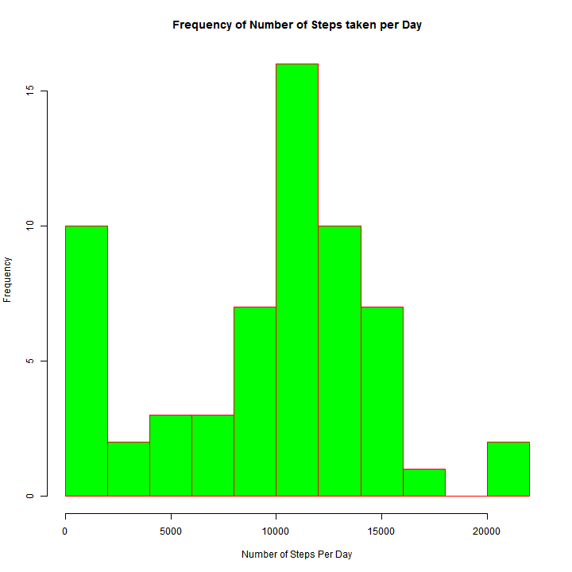
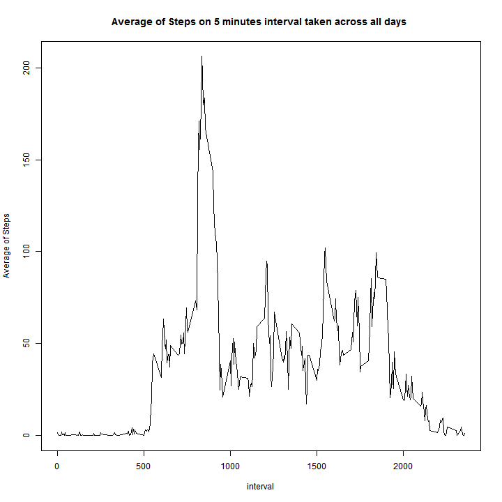
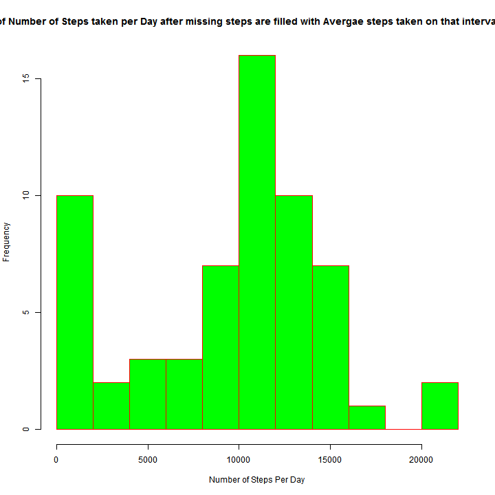
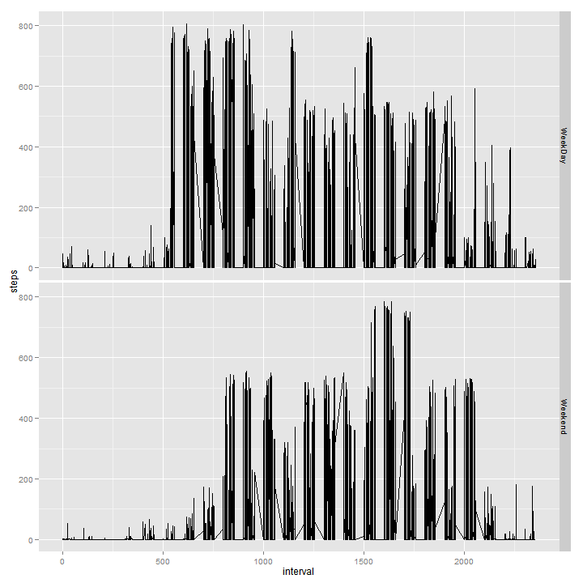

## Initial Loading 

With Below code, we load libraries needed for the program, set the directory and read the excel file. We also add more custoem columns to the data frame used in next steps 


```r
library(knitr)
library(ggplot2)
library(xtable)
library(plyr)
library(lubridate)
setwd ( "c:/temp")
data <- read.csv ( "activity.csv", sep = "," , header= TRUE, stringsAsFactors = FALSE, na.strings = "NA")

data$activityDate <- as.Date(data$date, "%Y-%m-%d")
data$day <- wday( data$activityDate)
data$datecategory <- ifelse ( data$day == 1 | data$day == 7 , "Weekend", "WeekDay")
nrow(data)
```

```
## [1] 17568
```

```r
summary(data)
```

```
##      steps           date              interval     activityDate       
##  Min.   :  0.0   Length:17568       Min.   :   0   Min.   :2012-10-01  
##  1st Qu.:  0.0   Class :character   1st Qu.: 589   1st Qu.:2012-10-16  
##  Median :  0.0   Mode  :character   Median :1178   Median :2012-10-31  
##  Mean   : 37.4                      Mean   :1178   Mean   :2012-10-31  
##  3rd Qu.: 12.0                      3rd Qu.:1766   3rd Qu.:2012-11-15  
##  Max.   :806.0                      Max.   :2355   Max.   :2012-11-30  
##  NA's   :2304                                                          
##       day    datecategory      
##  Min.   :1   Length:17568      
##  1st Qu.:2   Class :character  
##  Median :4   Mode  :character  
##  Mean   :4                     
##  3rd Qu.:6                     
##  Max.   :7                     
## 
```

```r
head(data)
```

```
##   steps       date interval activityDate day datecategory
## 1    NA 2012-10-01        0   2012-10-01   2      WeekDay
## 2    NA 2012-10-01        5   2012-10-01   2      WeekDay
## 3    NA 2012-10-01       10   2012-10-01   2      WeekDay
## 4    NA 2012-10-01       15   2012-10-01   2      WeekDay
## 5    NA 2012-10-01       20   2012-10-01   2      WeekDay
## 6    NA 2012-10-01       25   2012-10-01   2      WeekDay
```

## Mean total number of steps taken per day


```r
dailySummary <- ddply ( data, .(activityDate), summarise, total.step = sum(steps, na.rm=TRUE) )


summary( dailySummary$total.step)
```

```
##    Min. 1st Qu.  Median    Mean 3rd Qu.    Max. 
##       0    6780   10400    9350   12800   21200
```

```r
hist ( dailySummary$total.step , breaks = 15, col="green", border = "red", 
       freq=TRUE, plot = TRUE , xlab = "Number of Steps Per Day", ylab= "Frequency" , 
       main= "Frequency of Number of Steps taken per Day")
```

 


```r
m <- median(dailySummary$total.step, na.rm = TRUE)


i <- mean(dailySummary$total.step, na.rm = TRUE)
```

The average of total number of steps taken per day is 9354.2295, while the median was 10395

## average daily activity pattern?


```r
intervalSummary <- ddply ( data, .(interval), summarise, avg.step = mean(steps, na.rm=TRUE) , 
                                                         max.step = max(steps, na.rm= TRUE))


plot ( intervalSummary$interval, intervalSummary$avg.step , 
       type = "l" , xlab="interval", 
       ylab="Average of Steps", 
       main= "Average of Steps on 5 minutes interval taken across all days ")
```

 

As Plot shows, the most of actvities are around 9 to 10 morning. 

## What is effect of Missing data in dataset


```r
q <- colSums ( is.na (data))

q
```

```
##        steps         date     interval activityDate          day 
##         2304            0            0            0            0 
## datecategory 
##            0
```

```r
head(data)
```

```
##   steps       date interval activityDate day datecategory
## 1    NA 2012-10-01        0   2012-10-01   2      WeekDay
## 2    NA 2012-10-01        5   2012-10-01   2      WeekDay
## 3    NA 2012-10-01       10   2012-10-01   2      WeekDay
## 4    NA 2012-10-01       15   2012-10-01   2      WeekDay
## 5    NA 2012-10-01       20   2012-10-01   2      WeekDay
## 6    NA 2012-10-01       25   2012-10-01   2      WeekDay
```

We populate missing steps with average of steps taken on that interval across all days. 


```r
data1 <-merge ( data, intervalSummary, by.x="interval" , by.y="interval" )


data1$steps[is.na(data1$steps)] <-  data1$avg.step
```

```
## Warning: number of items to replace is not a multiple of replacement
## length
```

```r
dailySummary1 <- ddply ( data1, .(activityDate), summarise, total.step = sum(steps, na.rm=TRUE) )


hist ( dailySummary$total.step , breaks = 15, col="green", border = "red", 
       freq=TRUE, plot = TRUE , xlab = "Number of Steps Per Day", ylab= "Frequency" , 
       main= "Frequency of Number of Steps taken per Day after missing steps are filled with Avergae steps taken on that interval across all days")
```

 


```r
m1 <- median(dailySummary1$total.step, na.rm = TRUE)

m1

i1 <- mean(dailySummary1$total.step, na.rm = TRUE)

i1
```

####
After filling missing steps with Average steps for that interval across all daya, The average of total number of steps taken per day is 9371.4371,
and median was 1.0395 &times; 10<sup>4</sup>

Compared to original dataset, the median hasn't changed, that means, the missing steps are not for frequent intervals, also the mean of dataset hasn't been changed a lot, that means the data that was missing are for intervals that usually there were not much of acitvities.


## Differences in activity patterns between weekdays and weekends
As graphs in bleow represent, during week Days, the average number of steps during morning until 12PM is much higher than weekends.


```r
qplot( interval, steps, data=data1 , type = "l", facets =  datecategory~., geom= "line")
```

 
